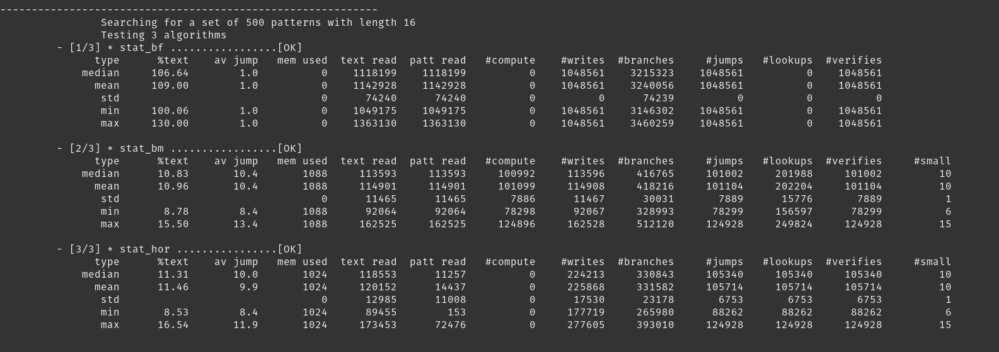

# Algorithm measurements
Smart can provide measurements and statistics on the internal operation of algorithms, using an instrumented version of the algorithm to capture the information.

## Measurements captured

As standard, it can capture:

* Memory used - the amount of memory consumed by any large allocations like lookup tables.
* Number of entries in lookup tables - the number of discrete entries in any lookup tables used.
* Text bytes read - the total number of bytes read from the text while searching.
* Pattern bytes read - the total number of bytes read from the pattern while searching.
* Count of significant computations - 'significant' is a subjective measure that may vary by algorithm.
* Count of writes to a value - the number of times a value must be stored - e.g. calculations, loop counters.
* Count of branches - the number of times the algorithm branches (ifs or loops).
* Count of lookups - the number of times a value is read from a lookup table.
* Count of verification attempts - number of times we test to increment the search count.
* Count of jumps - the number of times the search position is advanced.

Additionally, it provides up to 6 named algorithm-specific fields to capture information specific to each algorithm.  For each run, it computes 

* the percent of text read by the algorithm, 
* the average jump achieved,
* the median, mean, standard deviation, minimum and maximum values for each of the measured and computed fields.



In the example above, we are measuring algorithm stats for Brute Force (BF), Boyer-Moore (BM) and Horspool (HOR).  We can see that BM and HOR both define an additional field `#small` to capture data about the number of entries in its lookup table that have a smaller value than the pattern length, whereas BF only captures the standard set of measurements.

## How to run
To capture algorithm measurements instead of performance measurements, use the `-stats algo` command.  For example, to get statistics for the Brute Force, Boyer-Moore and Horspool algorithms, use:

`smart run bf bm hor -text englishTexts -stats algo`

Note that we specify the algorithm names on the command line *exactly* the same as for performance measurements, but if ```-stats algo``` is used, smart automatically chooses the ```stat_``` version of each algorithm to test, so we end up running ```stat_bf```, ```stat_bm``` and ```stat_hor```.  This enables us to use the same named sets of algorithms for either performance or algorithm statistic generation.

There must, of course, be a `stat_` version of an algorithm we want to gather algorithm statistics for.
These are instrumented versions of an algorithm, saved with a `stat_` filename prefix.

### Running all
To run all the instrumented algorithms, just use the `-all` flag as normal.

```shell
smart run -all -text englishTexts -stats algo
```
When in `-stats algo` mode, it will select all the algorithms with a `stat_` filename prefix.
Conversely, when in `-stats perf` mode, it will select all the algorithms without a `stat_` filename prefix.

## Output
In addition to the statistical summary written to the console during operation, two CSV files are written at the end of the experiment, containing the statistical summary and the raw measurements taken for each run of the algorithm.

## Instrumenting an algorithm
In order to gather algorithm statistics, a special version of that algorithm must be created and instrumented to gather the measurements we are interested in.  In general, the process is simple:

1. Copy the algorithm we want to instrument to a new file, and prefix its old filename with `stat_`.
2. Insert lines to capture standard algorithm stats into the new file.  
3. Define any additional data we want to capture in the extra fields and capture it.
4. Define the name(s) of any additional data we capture.

All algorithm statistics are captured using a local struct called `_stats`, defined in `main.h` which all algorithms use.

### Example instrumentation
Below is an instrumented version of the Horspool (HOR) search algorithm.  We gather statistics on the number of writes, branches, jumps, verifications, lookups, text and pattern bytes read.  We also define one extra field `#small` to record how many entries in the lookup table are smaller than the pattern length `m`.

Note that there are some utility methods defined in `main.h` to simplify setting the names of extra fields using `set_extra_name()`, and some other methods to calculate statistics for various types of lookup table.

```C
   _stats.memory_used = SIGMA * sizeof(int);
   _stats.num_lookup_entries1 = SIGMA;
   _stats.extra[0] = count_smaller_entries_int_table(hbc, SIGMA, m);
   set_extra_name("#small", 0);

   /* Searching */
   BEGIN_SEARCHING
   s = 0;
   count = 0;
   _stats.num_writes += 2;
   _stats.num_branches++;
   while (s <= n - m) {
      i = 0;
      _stats.num_writes++;

      if (i < m) {
          _stats.text_bytes_read++;
          _stats.pattern_bytes_read++;
      }
      
      _stats.num_branches++;
      while (i < m && P[i] == T[s+i]) {
          i++;
          _stats.num_writes++;

          if (i < m) {
              _stats.text_bytes_read++;
              _stats.pattern_bytes_read++;
          }
          
          _stats.num_branches++;
      }

      _stats.num_branches++;
      _stats.num_verifications++;
      if (i == m) count++;

      s += hbc[T[s + m - 1]];
      _stats.num_writes++;
      _stats.num_lookups++;
      _stats.text_bytes_read++;
      _stats.num_branches++;
      _stats.num_jumps++;
   }
   END_SEARCHING
```


## Instrumentation Guidance
Instrumenting algorithms is mostly quite straightforward.
However, there are a few areas where you have to be careful to ensure you capture accurate measurements,
that will be comparable to other instrumented algorithms.

### Memory usage
The aim of tracking memory usage isn't to account for every byte used by an algorithm in operation, e.g. variables.
We want to know how much significant memory is used.  This is usually in the form of lookup tables, containing a number of integers or characters.

We want to record the number of bytes used, so we will need to multiply the number of entries in them by the number of bytes contained in their datatype.
Some algorithms use more than one table, so the memory used by each should be summed. 
If an algorithm requires additional space in the text to write to (e.g. where a sentinel pattern is being used),
this should also be counted as a memory requirement of the algorithm, even though this usage isn't a lookup table. 

### Counting loop branches
When measuring the branches taken in loops, you may be tempted to just add a branch in the body of the loop, as so:

```C
while (i > 0) {
    i--;
    _stats.num_branches++; // will not count the first branch, e.g. if i <= 0
}
```
However, this will fail to count the first branch.  If i <= 0 right at the start, then no branches will be counted as the loop body will not execute.  More generally, each loop has at least one branch (regardless of whether the loop body executes), and then will have another branch for each time the body of the loop executes.
To count loop branches accurately, you must count the first branch before the loop starts.

```C
_stats.num_branches++; // count the first test of the loop
while (i > 0) {
    i--;
    _stats.num_branches++; // count the next test of the loop.
}
```

### Counting inside loop conditions
Sometimes there are things we want to measure, such as the number of pattern bytes read, which are performed inside a loop condition.  For example:
```C
_stats.num_branches++;
while (P[i] == T[s + i]) { // If the pattern at P[i] matches the text at T[s + i].
    i++;
    _stats.pattern_bytes_read++; // will fail to count if loop condition wasn't satisfied.
    _stats.text_bytes_read++;    // will fail to count if loop condition wasn't satisfied.
    _stats.num_branches++;
}
```
Similarly to measuring loop branches, this will fail to record the first pattern and text bytes read.
If the pattern does not match the text on the first iteration, then we will never increment the stats, even though they were read in the loop condition.
The solution is the same as for loop branches; we have to increment the bytes read *before* the loop begins, and then inside the loop body for every extra iteration.

```C
_stats.pattern_bytes_read++; // first iteration of the loop reads P[i]
_stats.text_bytes_read++; // first iteration of the loop reads T[s+i]
_stats.num_branches++;
while (P[i]==T[s+i]) { // If the pattern at P[i] matches the text at T[s + i].
     i++;
    _stats.pattern_bytes_read++; // next iteration of the loop will read P[i]
    _stats.text_bytes_read++;    // next iteration of the loop will read T[s+i]
    _stats.num_branches++;
}
```

### Complex loop conditions
Loops can sometimes have additional conditions that are tested *before* the things we want to measure. 
For example, from the Horspool algorithm, above, we have:

```C
while (i < m && P[i] == T[s+i]) 
```
This will only read the pattern and text bytes if the condition that `i < m` is satisfied.  Therefore, we can only count these values if that condition is satisfied first.

```C
if (i < m) {
    _stats.pattern_bytes_read++; // first iteration of the loop reads P[i] if i < m
    _stats.text_bytes_read++; // first iteration of the loop reads T[s+i] if i < m
}
_stats.num_branches++;
while (i < m && P[i] == T[s+i]) { // If the pattern at P[i] matches the text at T[s + i].
    i++;
    if (i < m) {
        _stats.pattern_bytes_read++; // next iteration of the loop will read P[i] if i < m
        _stats.text_bytes_read++;    // next iteration of the loop will read T[s+i] if i < m
    }
    _stats.num_branches++;
}
```
Note that we do not count the tests we added for `i < m` as additional branches, as they are only included to make accurate measurements.
They are not branches the actual algorithm would perform; they are part of the measurement code.

### Counting verification attempts
It is not always obvious where to count a verification attempt has occurred.
Different algorithms have different strategies for matching and verification.
Some algorithms implicitly or explicitly verify on each loop, and some will only proceed to verification if other tests are satisified.
In general, we should count a verification attempt at the point where we test to increment the search count.

```C
_stats.num_branches++;
_stats.num_verifications++;
if (PATTERN_VERIFIED_SOMEHOW) count++;
```

### Verification utility method
Verification is often done using a simple loop that compares the pattern to the text, or using something like `memcmp`.
It can be tricky and repetitive to count algorithm statistics for this, so there is a utility method defined in `main.h` called `stats_match_length()`.
This returns the length of the text matched in the text at the specified position.
If the length returned is equal to the length of the pattern, then there is a match.

```C
// verify that a pattern x of length m exists at position pos in the text T of length n.
_stats.num_branches++;
_stats.num_verifications++;
if (stats_match_length(pos, x, m, T, n) == m) count++;
```

It will accurately count any pattern bytes and text bytes read, the number of branches required and any values written (i.e. loop counter).
You do not have to use this method, but where it can be applied it makes things easier than writing from scratch each time.

Note that we count a branch for the test that the value returned is equal to the length of the pattern, `m`.
This is still a test the algorithm would have to perform, regardless of its matching loop, so we count it as an algorithm stat, not an artefact of using the utility method.

### Counting jumps
A jump occurs when the search position is advanced.  Most of the time, this occurs just before the algorithm goes around its main loop again.
Some algorithms also have "fast" loops embedded within the main loop that can also advance the search position.  These also need to be accounted for.

The average jump achieved is calculated after measurements have been taken,
from the number of jumps made and the length of the text.

### Extra fields
There are 6 additional long integer fields for algorithms, indexed from 0 to 5, to store information that is relevant to their particular operation.
In general, simple values or counts seem to provide the best type of measurement.
These can be easily averaged, a median taken and other statistics derived from them.
Any derived statistics are usually best performed once the raw measurements are taken.
It may be necessary to record two values, e.g. the absolute size of something and the
count of how many times something occurs in it, allowing further statistics to be derived
from the two quantities later.

#### Naming 
If you want to see extra fields displayed on the console, you have to give them a name,
by calling `set_extra_name(name, index)`.
The length of a name is limited to only 10 characters (or they are not easily displayed).

All measurements will be output to the CSV files, along with any names which were provided.
It is recommended to set a name, as it makes subsequent understanding and filtering of the 
data easier. 


#### Lookup table measurements
Many search algorithms have one or more lookup tables derived in pre-processing and used during search.
It can be interesting to examine how these tables are filled in various ways,
for example, the number of bits which are set, the number of non-zero entries, or some other quantity.
The performance of an algorithm can be strongly correlated with the construction
of its lookup tables.

#### Event measurements
Measuring how often something happens during an algorithm run can be of interest.
For example, we might want to know how many times a mismatch occurs in a certain operation.
It is usually helpful to also record the total number of attempts, so the proportion of times
the event occurs can be calculated.
